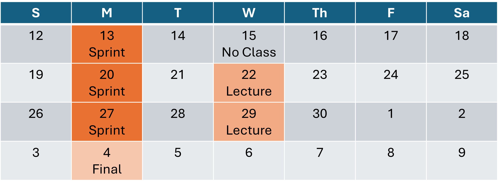
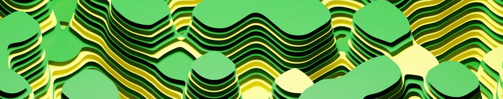
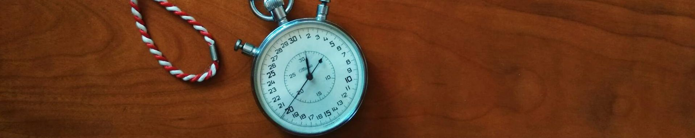
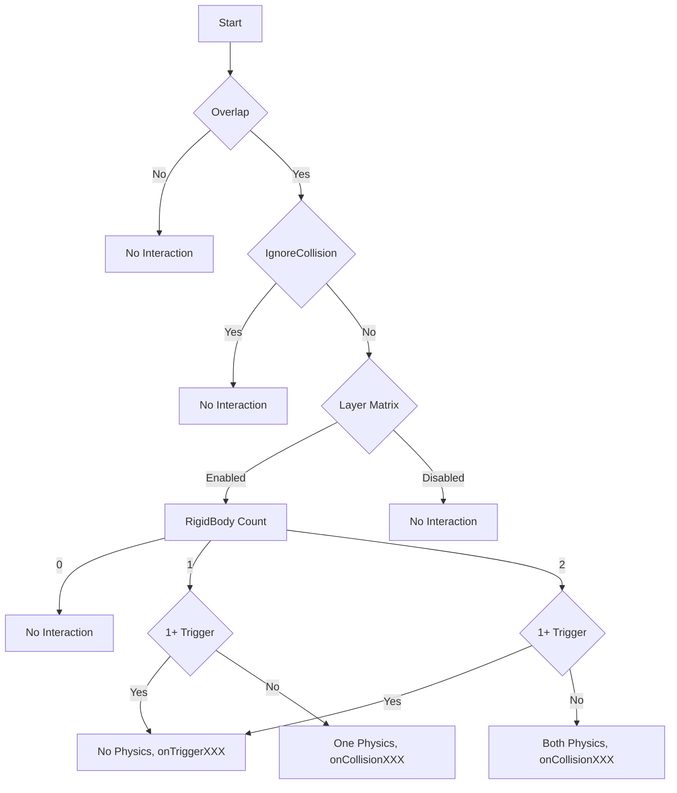
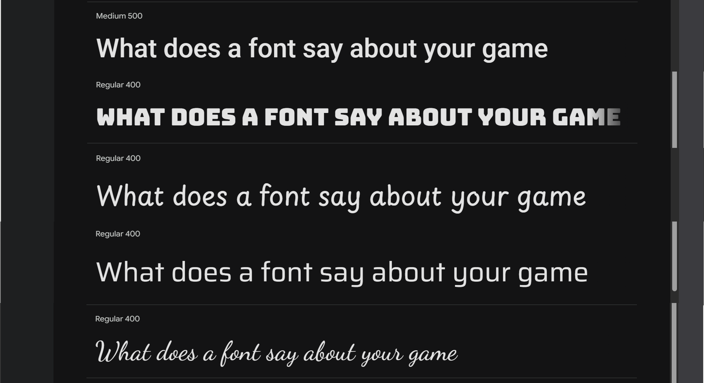
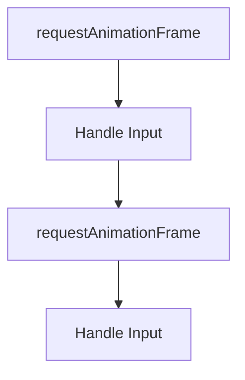
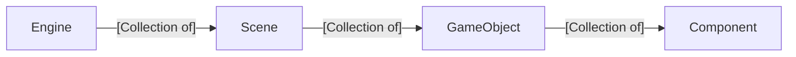

# CS 2510, Spring 2026, Topics
These are the topics we are going to cover in class each day. Links to [example student videos ](https://www.youtube.com/playlist?list=PLH9qo0GKu2iSlchbSeksN18S87gMIjHOg) and [slides from class](https://uofnebraska-my.sharepoint.com/:f:/g/personal/17816140_nebraska_edu/IgCOKBir22_NTq0uqlhKQTlNATgnX2nljSQqcI5skgvuM2A?e=A1hhjT)


---
---

<<<<<<< Updated upstream
# Day 28 -   - Behavior Trees (🧑‍🏫Lecture)

## 🖼️Activity:
- Look at the boss in a game. How would you describe their behavior?
- Look at a game character will a pursuit behavior. How would you describe that behavior?
- Think about the rules you follow when you came to class today. How would you describe the things you thought about?

## 💡New Idea: AI abstraction
- AI in games can be implemented at one of three levels of abstraction
  - Simple if statements
  - State machines
  - Behaviors trees
- There are other approaches, but these are the major methods of abstraction.
  - What is abstracting AI important?
    - It allows other people to work just on AI
- Behavior trees are used throughout AAA games.
- Unreal Engine pioneered behavior trees in the commerical game engine space, but other game engines have adopted them as well.
- One advantage of Behavior Trees is that they are easy to represent and debug graphically.
- Behavior trees are *trees* that a component traces when it makes a decision
- Behavior trees are made of nodes.
  - There are control nodes that determine the path the logic takes in the tree
  - There are ?action node that update the state of game objects
- Control nodes can have child nodes.
- All nodes have to return one of three values
  - SUCCESS - The node has completed its task
    - For example, the NPC found the player, the NPC finished a patrol cycle, or a control node finished calling all of its children
  - FAILURE - The node failed to complete its task
    - For example, the NPC could not find the player, something is blocking the NPC from finishing a patrol cycle, or a control node had a child node that returned FAILURE.
  - RUNNING - The node did not succeed or fail. It should be called again on the next update.
    - For example, an NPC is still trying to find the player, the NPC is in the middle of a patrol cycle, or a control node had a child node that returned RUNNING

## 👩‍💻Code Together:
- Build the major conttrol nodes
- Build ?action nodes
- Put them together to control an NPC in a game

## 🧭Ideas to explore on your own
- There are lots of control nodes that we can't cover in a lecture
  - Random pick nodes
  - Invert nodes
  - Look at AI you have implemented in your game. How could be convert that into behavior trees?


=======
# Day 28 - April 29 - Behavior Trees (Lecture 16)

# Example Behavior Trees
[Unreal Engine Example](https://d3kjluh73b9h9o.cloudfront.net/optimized/4X/d/a/7/da701fc6b7758397daf3fac0218c14dc68848ab3_2_1035x612.png)

# Can you build the behavior tree
- [Hollow Knight Playthrough](https://www.youtube.com/watch?v=G1atkq4C1KU) - Start at minute 6?


# Day 27 - April 27  - (👟Sprint 12)
>>>>>>> Stashed changes
<br/><br/>
---
---


<<<<<<< Updated upstream
# Day 26 -   - Letter Boxing (🧑‍🏫Lecture)

## 🖼️Activity:
- Identify letterboxing in games. For example, how is letter boxing used in [Brawl Stars](https://www.youtube.com/watch?v=j6nQgmtcN18)
- Look at the aspect ratios used in iPhones over time. We can't predict the aspect ratio that the user will have, thus necessetating letter boxing.
- The term letter boxing comes from early film where there were different aspect ratios in use--letter boxing was the solution.

## 💡New Idea:
- Letter boxing allows a game to have a fixed aspect ratio. This means your game will look the same, regardless of the size of the browser window.
  - This makes it easier to predict what the user will see
  - This can be used to prevent cheating or unfair advantanges on eGames
  - This is *really* helpful when it comes to designing a UI

## 👩‍💻Code Together:
- Add letter boxing to our game
  - We need to specify the aspect ratio that we want in our game
  - We need to specify the width of the camera in world space
  - We draw letter boxing after we draw the scene
  - We draw four letter boxing rectangles, but at least two of them will have a width or height of 0, so they won't be seen
  - The game objects drawn in world space do not need to be offset
  - The game objects drawn in UI space do need to be offset
  - We need to store the current size of the letter boxing in the Engine so it can be used throughout the game
  - Letter boxing will also affect our screen space to UI space calculations, so this will alter our calculations about where the mouse is when we are checking for collisions in UI space.

## 🧭Ideas to explore on your own
- How could you add letter boxing to your game that doesn't use plain rectangles.
- Browsers can be shrunk down to very small sizes. There are ways to try to force a browser window to be a certain size, but there are really no guarantees.
- Can you find examples of letter boxing in other games?

=======
# Day 26 - April 22 - Letter Boxing (Lecture 15)

# Day 25 - April 20 - (👟Sprint 11)
>>>>>>> Stashed changes
<br/><br/>
---
---


<<<<<<< Updated upstream
# Day 23 - April 13 - Collision Layers (👟Sprint 10)
=======
#  Day 23 - April 13 - Collision Layers (👟Sprint 10)
>>>>>>> Stashed changes


## 💡New Idea: Scenes can have background colors
- This allows you to really differentiate start and stop scenes from the main game scenes
- The Camera component of the main camera stores the background color

## 💡New Idea: Collision Layers
- Collision detections is an $O(n^2)$ operation.
- We can speed up collision calculations by restricting the set of collisions it calculates
- The list of possible collision is based on the layer system
- The list of possible collision options are called collision layers

## 👩‍💻Code Together: Collision Layers
- Add a list of collision layers in the Engine
- In the Scene, check if there are any collision layers
  - If not, check all pairs of collisions like before
- Only check collisions between the layers in collision layers


<br/><br/>
---
---


# Day 22 - April 8 - Layers & Cameras (🧑‍🏫Lecture 13)


## 💡New Idea: Games are Drawn with Layers
- See slide on layers
- Think of them as a stack of transparencies

## 🖼️Activity: Look at Hollow Knight for Layers
- [Hollow Knight Speed Run](https://www.youtube.com/watch?v=7n9ngN8n8sQ&t=550s)
- Which layers did you see in the game

## 👩‍💻Code Together: Layers
- Add the ability to add game options when you start a game
- Add a list of default layers to the engine
- If there are options and there are layers, add those to the layers in the engine
- Allow game objects to have a layer property. 
  - Set its default value to "default"
- Allow game objects to have an options parameter in their constructor
- In the scene, loop over the layers and then loop over game objects in that layer when rendering
- Show a test scene with and without layers working.

## 💡New Idea: Games are Drawn with a Camera
- Early games didn't have a camera
- Some puzzle games don't have a camera
- But most everything else does

## 👩‍💻Code Together: Cameras
- Add a Camera component to the engine
  - Add a Camera.main getter that returns a game object named Camera
- In the Scene constructor, add a Camera game object with a Camera component as the first item
- Before you render, apply the **inverse** of the camera transform
- Make the camera follow a game object in a game

## 💡New Idea: UI Layers are drawn above the camera
- UI element move with our current setup

## 👩‍💻Code Together: Stationary UI Layer
- When rendering, filter out the UI layer from the main render loop
- After restoring from the main render loop, separately render the game objects on the UI Layer


## 🖼️Activity: Look at the Camera in Super Smash Bros for Cameras
- Start about :45 - [Super Smash Bros Ultimate, 4 Players](https://www.youtube.com/watch?v=QrZn4trMK_U)

## 💡New Idea: Cameras need several properties to look good
- Cameras should not go out of boundaries
- The camera should give the player some leeway

## 👩‍💻Code Together: Camera properties
- Clamp the position of the camera to be within certain bounds
- Only move the camera if it is offset from the goal by a certain amount
- Add a Mathf class with a clamp function
  - Similar to the Mathf functions in Unity.

## 🏁Final Code
- [The final code for today](https://github.com/CS2510/Spring26-Day22-Cameras)
<br/><br/>
---
---


# Day 21 - April 6 - Tracking scenes (👟Sprint 9)

- If we track the originating scene when we instantiate a game object, then we can remove appropriate game objects when we want to remove a scene that was added additively.
## 🏁Final Code
- [The final code for today](https://github.com/CS2510/Spring26-Day21-Scene-Tracking)
<br/><br/>
---
---


# Day 20 - April 1 - (🧑‍🏫Lecture 12)


## 🖼️Activity: Game are built using hierarchies
- Look for game object hierarchies in [Mario Kart 64](https://www.youtube.com/watch?v=w8K-heSWX8s)
- Look how game object hierarchies are used in [Echoes of Wisdom](https://youtu.be/01onjjAUnOQ?si=_08wHwSa2sMCxuGz&t=123)
- Look how game object hierarchies are used in [Zero Company](https://www.youtube.com/watch?v=rcxnRaZ6slU)
- Look how game object hierarchy are used in [Zelda Tears of the Kingdom](https://www.youtube.com/watch?v=m9_O94KqRAo)

## 💡New Idea: Game Object Can Have Child Game Objects
- This create powerful hierarchies
  - Allows for game objects to "hold" other game objects
  - Easy alignment of UI
  - Complex rotational movements

## 👩‍💻Code Together: Game Object Hierarchy
- Update Transform
  - setParent
  - getLocalMatrix
  - getGlobalMatrix
- Update GameObject draw
- Update Collisions
- Orbiting colliders


## 🧭Ideas to explore on your own
- How can you convert your game to use hierarchies?
- 

## 🏁Final Code
- [The final code for today](https://github.com/CS2510/Spring26-Day20-Hierarchies)
<br/><br/>
---
---


# Day 19 - March 30 - SceneManager (👟Sprint 8)


## 💡New Idea: Delayed Scene Changes
- We don't want to change the scene in the middle of an update loop.
- Instead, we want to update the next time we start a frame in the game loop
- By tracking the next scene in SceneManager, we can wait to make the change at the appropriate time.

## 👩‍💻Code Together: Update the SceneManager Class
```js

 class SceneManager{
     static currentScene
     static nextScene
     static update(){
         if(SceneManager.nextScene){
             SceneManager.currentScene = SceneManager.nextScene
             SceneManager.nextScene = undefined
         }
     }
     static loadScene(scene){
         
         SceneManager.nextScene = scene
     }
     
     static getActiveScene(){
         return SceneManager.currentScene
     }
 }
```


## 🏁Final Code
- [The final code for today](https://github.com/CS2510/Spring26-Day19-SceneManager)

<br/><br/>
---
---


# Day 18 - March 25 - Gravity & Platformers (🧑‍🏫Lecture 11)


## 💡New Idea: Acceleration & Velocity
- Every frame, acceleration updates velocity
- Every frame, velocity updates position

## 👩‍💻Code Together: Rigid Body
- Add a new component with the following member variables:
  - acceleration (cleared every frame)
  - gravity (constant)
  - velocity
- Update velocity with acceleration + gravity
- Clear acceleration
- Update position with velocity


## 💡New Idea: Platformer Dynamics
- Characters can't jump if they aren't grounded
- Characters don't slip through platforms
- Gravity is rarely exactly true gravity
- Characters need a terminal velocity
- Characters often can double jump
- Charcters don't float when they bump their heads

## 👩‍💻Code Together: Platformer Dynamics
- Add an isGrounded variable
  - Set to true when there is a collision below and you are heading down
  - Set velocity to 0
- Add a double jump variable
  - Invert whenever you jump
- Cap downward velocity
- Pick your own gravity
- When you hit something above you and you are going up, set velocity to 0

<!-- When do I add fixed update? -->
<!-- Somewhere in here I had to change collisions so they were done in order of power. Collisions that don't count anymore are ignored. -->


## 🏁Final Code
- [The final code for today](https://github.com/CS2510/Spring26-Day18-Platformer)
<br/><br/>
---
---


# Day 17 - March 23 - (👟Sprint 7)

- Discussed `Time.time`
- Discussed `Time.framecount`
- 
## 🏁Final Code
- [The final code for today](https://github.com/CS2510/Spring26-Day17-Time)
<br/><br/>
---
---


# Day 16 - March 11  - 🤒 Class Canceled


<br/><br/>
---
---


# Day 15 - March 9 - (👟Sprint 6)
<br/><br/>
---
---


# Day 14 - March 4 - Physics (🧑‍🏫Lecture 9)


# Collision Events
- If either game object is marked as a trigger, then trigger events are fired:
  - onTriggerEnter
  - onTriggerStay
  - onTriggerExit
- If neither game object is marked as a trigger, then collision events are fired:
  - onCollisionEnter
  - onCollisionStay
  - onTriggerStay
 
# Collision types

## Coins (Ghosts Objects)
- Powerups like coins have the following properties
  - They can't push objects
  - They aren't pushed
  - They don't initiate collision events
- Ground/Elevators/Platforms have the following properties
  - They push objects
  - They aren't pushed
  - They don't initiate collision events
- Sensors (invisible colliders) have the following properties
  - They don't push objects
  - They aren't pushed
  - They initiate collision events
- Characters have the following properties
  - They push objects
  - They get pushed
  - They initiate collision events
- Here is a table with the same information:

| Type        | Is Pushed? | Pushes Back? | Initiates Events? | isTrigger? | RigidBody? |
| ----------- | ---------- | ------------ | ----------------- | ---------- | ---------- |
| 🪙 Coin      | No         | No           | No                | Yes        | No         |
| 🛗 Floor     | No         | Yes          | No                | No         | No         |
| ❓Sensor     | No         | No           | Yes               | Yes        | Yes        |
| 🏃 Character | Yes        | Yes          | Yes               | No         | Yes        |


# Detailed Collision Rules
- If two colliders on different game objects do not overlap, there is no interaction
  - No Physics, no events
  - Break
- If we get here, we know two colliders on different game objects overlap
- If you use Physics.IgnoreCollision, there is no interaction between colliders
  - https://docs.unity3d.com/6000.3/Documentation/ScriptReference/Physics.IgnoreCollision.html
  - No physics, no events
  - Break
- If you disable collisions in the Layer Collision Matrix, then there is not interaction between the colliders on those layer(s)
  - https://docs.unity3d.com/6000.3/Documentation/Manual/LayerBasedCollision.html
  - No physics, no events
  - Break
- If neither of the game objects have a Rigid Body, then there will be no interaction between the colliders
  - https://discussions.unity.com/t/what-are-the-oncollisionenter-requirements/104083
  - No physics, no events
  - Break
- If we reach this point, then the physics engine will respond to the overlap of the colliders. We know that the colliders haven't been disabled with Physics.IgnoreCollisions, we know the layers the colliders are in are allowed to collide in the Layer Collision Matrix, and we know at least one of the game objects has a rigidBody attached
- If either of the colliders is marked as a trigger, then:
  - No physics, onTriggerXXX events
- If we get here, neither of the colliders is marked as a trigger and we have at least on rigid body between the pair
  - If they are both have rigid bodies
    - Physics response on both, onCollisionXXX events
  - If one has a rigid body
    - Physics response only on the one with a rigid body, onCollisionXXX events for both





## 🏁Final Code
- [The final code for today](https://github.com/CS2510/Spring26-Day14-Collision-Resolution)
<br/><br/>
---
---

# Day 13 - March 2  - Events (👟Sprint 5)

## 💡New Idea: Events
- Events provide a way for us to [loosely-couple](https://en.wikipedia.org/wiki/Loose_coupling) components that need to communicate
- Setting up events requires three steps
  - Registering an event listener
  - Firing an event
  - Handling the event

## 👩‍💻Code Together: Events
- Change the interaction between the enemy component and the score so that it uses events
- Change the interaction between the button on the start scene so it is loosely coupled.

## 🏁Final Code
- [The final code for today](https://github.com/CS2510/Spring26-Day13-Events)

<br/><br/>
---
---


# Day 12 - February 25 - Mouse Collisions (🧑‍🏫Lecture 8)


## 🖼️Activity: Look at an early game that used the mouse
- 1993's The Incredible Machine utilized the mouse to create a novel puzzle game
- [Gameplay from The Incredible Machine](https://www.youtube.com/watch?v=pTbSMKGQ_rU)

## 💡New Idea: Colliders
- A collider is a component that tells the collision engine that it is listening for collisions
- A collider has a list of points that default to the points listed in the game object's polygon 
  - Overriding these points can make it so we can collide against simpler geometry that what is displayed, a common technique in games

## 💡New Idea: Mouse Collision Events
- We listen for three mouse collision events
  - onMouseEnter - The mouse overlapped a collider for the first time this frame
  - onMouseOver - The mouse overlapped a collider that it overlapped a previous frame
  - onMouseExit - The mouse no longer overlaps a collider that it overlapped the previous frame
- To do this, we need to track mouse collision this frame and the previous frame

## 💡New Idea: Mouse Button Events
- We listen for four mouse button and collision events
  - onMouseDown - the mouse overlaps a collider and the mouse went down this frame
  - onMouseUp - The mouse overlaps a collider and the mouse went up this frame
  - onMouseUpAsButton - The mouse overlaps a collider, the mouse went up this frame, and the mouse has been continuously overlapping this collider since the frame the button went down
  - onMouseDrag - The mouse overlaps a collider, the mouse button is down, and the mouse is moving
- To do onMouseUpAsButton this, we need to track the colliders that the mouse overlapped since the last time the mouse button went down
  - Notably, when we have an onMouseExit, that collider should be removed from the list
- A naive implementation of onMouseDrag will fail when the user moves the mouse quickly. To solve this, we track on onMouseDrag on all overlaps this frame and the previous frame. If we call onMouseDrag from a collider from the previous frame, then we add readd it to the list of objects that were updated this frame.

## 🖼️Activity: Look at an early game that used the mouse
- Deja Vu: A Nightmare Come True was an early escape room game
- [Gameplay from Deja Vu: A Nightmare Come True](https://www.youtube.com/watch?v=xwrqhsTFTVU)


## 🏁Final Code
- [The final code for today](https://github.com/CS2510/Spring26-Day12-Mouse-Events)
<br/><br/>
---
---


# Day 11 - February 23 - Input This Frame (👟Sprint 4)


## 💡New Idea: Input This Frame
- We often need to know when a key or mouse button goes down or up, not just when it is held down
  - For example, when to fire a laser or when to "click" a button
- To do this, we need to track what input events happened each frame.
- We clear what happened each frame with an update function in Input


## 🏁Final Code
- [The final code for today](https://github.com/CS2510/Spring26-Day11-Advanced-Input)

<br/><br/>
---
---


# Day 10 - February 18  - Collisions Prep(🧑‍🏫Lecture 7)


## 🖼️Activity:
- Look at collisions in a game: https://www.allsonicgames.net/sonic-the-hedgehog.php


## 💡New Idea: Vector Operations
- In order to do collisions, we need to be able to do lot of different operations on vectors
- `add` adds two vectors together
- `minus` subtracts two vectors
- `magnitude` is a property (getter) that returns the length of the vector
  - The length of a vector is the square root of the sum of the squares of its components
- `normalize` returns a vector that has a length of one
  - We do this by dividing `x` and `y` by the magnitude of the vector
- `orthogonal` returns a vector that is orthogonal (perpendicular) to the given vector

## 💡New Idea: Vector Multiplication
- There are three basic ways to multiply vectors in game programming: `times`, `scale`, and `dot`
  - We can also do a cross product, but we don't need that for collision detection

$$ v\ times\ s = (v_{x}*s, v_{y}*s)$$
$$ v_1\ scale\ v_2=(v_{1x}*v_{2x}, v_{1y}*v_{2y})$$
$$ v_1\ dot\ v_2=v_{1x}*v_{2x}+v_{1y}*v_{2y}$$

- We use `times` when we want to scale a vector by a single number (a scalar). For example, if I want to make a polygon twice as large in all directions, I would multiply each point in the polygon by one number using `times`
- We use `scale` when we want to scale a vector by another, non-uniform vector. For example,  if I want to make a square a rectangle, I would multiple each point in the square by a non-uniform vector using `scale`. The `scale` function is similar to the mathematical idea of component-wise multiplication.
- We use `dot` when we need to find the similarity between two vectors or project one vector onto another vector. For example, if I want to know if the heading of an enemy is nearly the same direction as the heading toward the player, I would multiple those two vectors using `dot`. As another example, if I want to project vector 1 on vector 2, I would multiple those two vectors using `dot`.
  - When two vectors have an identical heading, their dot product is 1. If there are orthogonal, their dot product is 0. If they are pointing in opposite directions, then the dot product will be -1.
  - Additional information can be found here: https://en.wikipedia.org/wiki/Dot_product

## 💡New Idea: Separate Axis Theorem
- Consider a point and a polygon. How do I know if the point is inside the polygon?
- What if I had a light that I shown on the point and line. If I can find a position for the light where the shadow of the point and polygon are not overlapping, then they can't be in collision.
- There are infinite positions for the "light". Smart mathematicials that shown that if we shine the light in the direction orthogonal to all the lines in the polygon, we have checked enough "lights"
- This does not work with concave polygons.
  - We can use Separate Axis Theorem if we break the polygon into sub-polygons, but that is out of scope for this project.


## 💡New Idea: Implementing the Separate Axis Theorem
- Working backward, write a function that takes points projected onto a line. Think of them as points that represent shadows. Can I determine if one point is between all the other points (the collision point and the projection of the polygon)
  - See if the point is between the min and max of the other points
- Given a direction of a "flashlight", can I determine if a point is in collision with a polygon
  - Project the point and polygon vertices onto a line perpendicular to the direction of the flashlight. See if there is an overlap
- Given a point and polygon, can I determine if there is any overlap?
  - Project the point and vertices onto the lines that are perpendicular to the edges of the polygon. Look for overlap.
- Given a point and a game object, can I determine if there is any overlap?
  - Move the vertices in the Polygon component based on the Transform component. Then see if there is any overlap.


## 💡New Idea: Types of Collisions

| Description                                                                                     | Type             |
| ----------------------------------------------------------------------------------------------- | ---------------- |
| Collisions without any physics response. For example, Mario touching a coin.                    | Trigger          |
| Collisions when one of the objects is fixed in place. For example, Sonic sanding on the ground. | Collision Static |
| Collisions when both objects respond to physics. For example, two marbles colliding.            | Collision        |

## 🏁Final Code
- [The final code for today](https://github.com/CS2510/Spring26-Day10-Point-Overlap)
<br/><br/>
---
---

# Day 09 - February 13  - (👟Sprint 3)

Additional information about communication. See Day 08

## 🏁Final Code
- [The final code for today](https://github.com/CS2510/Spring26-Day09-Communication)
<br/><br/>
---
---

<br/><br/>
---
---


# Day 08 - February 11 - Game Object Lifecycle & Communication (🧑‍🏫Lecture 6)


## 🔙Review
- Pushing to GitHub

## 💡New Idea: Game Object Lifecycle - Start
- Add `start`
  - We've had start functions but never used them
  - Track if a game object has started
  - When updating, call start first if we haven't started
- Add `instantiate`
  - Unity has a global function called `instantiate`. 
  - We can mimic that behavior

## 💡New Idea: Game Object Lifecycle - Destroy
- Add `destroy`
  - We don't destroy objects immediately
  - We mark them as having been deleted and remove them at the end of the update cycle
- Filter objects with `markForDelete`
  - Remove objects that have their mark for delete flag set
- Call `onDestroy` on game objects that are destroyed
  - `onDestroy` is the event we call on components when their parent game object is removed

## 💡New Idea: `broadcastMessage`
- We can simplify calls to all components in a game object with `broadcastMessage`
- `broadcastMessage` calls a given functions on all components with that function

## 💡New Idea: Named game objects
- To help us find game objects, each game object needs a name
- We add a name variable to `GameObject`
- We set the name of a game object in its `constructor`

## 💡New Idea: Communication - Find a component on a game object
- We often need to communicate within a game object
- If two components share a game object, they can communicate with `this.gameObject.getComponent()`
- `getComponent` returns a component of a given type using `instanceof`

## 💡New Idea: Communication - Find a game object within a scene
- We often need to communicate between components on different game objects
- We start by find the game object in question
  - We use the static function `find` on `GameObject`
  - `find` returns the first game object with a given name
- We then find the component we need to communicate with
  - `GameObject.find(<name>).getComponent(<type>)`

## 💡New Idea: Communication - Communicate across scenes
- We can't directly communicate between components on different scenes
- Instead we communicate indirectly
- One way to communicate indirectly is with `Globals`
- By setting a static variable on `Globals`, components in other scenes can query than variable.


<br/><br/>
---
---


# Day 07 - February 09  (👟Sprint 2)

Reminder to follow the course policies about academic integrity.

<br/><br/>
---
---

# Day 06 - February 04 - Text, Prefabs, and Time (🧑‍🏫Lecture 5)


## 🔙Review
- Time outside of class means times in front of the keyboard coding
- Working inside another engine does not count toward this class
- You can work ahead if you want


## 👩‍💻Activity: Think about fonts
- Look at the listed fonts.
- What game would you use each font for?


## 👩‍💻Activity: Look at the fonts used in a real game
- Look at [the fonts that SuperCell uses in Clash of Clans](https://fankit.supercell.com/d/vkEdmkUCngKw/font#/basics/clash-of-clans-fonts)


## 💡New Idea: Drawing Text
- We can create a component that renders text.
- This component is engine-specific, so we can put it in the engine
- In order to do this, we need to have public variables on the component for the text to draw

```javascript
class TextLabel extends Component{
    font = "20px Time"
    fillStyle = "black"
    text = "[No Text]"
    draw(ctx){
        ctx.save()
        ctx.translate(this.transform.position.x, this.transform.position.y)
        ctx.font = this.font
        ctx.fillStyle = this.fillStyle
        ctx.fillText(this.text, 0, 0)

        ctx.restore()
    }
}
```

## 💡New Idea: Generic Polygon
- We can create a component called Polygon that is generic to the engine
- In order to do this, we need to have public variables on the component for the list of points to draw

```javascript
class Polygon extends Component{
    points = []
    fillStyle = "black"
    strokeStyle = "transparent"
    lineWidth = 5
    draw(ctx){
        ctx.save()
        ctx.translate(this.transform.position.x, this.transform.position.y)
        
        ctx.beginPath()
        for(const point of this.points){
            ctx.lineTo(point.x, point.y)
        }
        ctx.closePath()

        ctx.fillStyle = this.fillStyle
        ctx.strokeStyle = this.strokeStyle
        ctx.lineWidth = this.lineWidth

        ctx.stroke()
        ctx.fill()

        ctx.restore()
    }
}
```

> [!Tip] History Moment
>
> The success of the original Nintendo Entertainment System (simply called Nintendo at the time) and the original Super Mario Bros. was electric. People wanted more and Nintendo responded to the demand by inventing a Super Mario Bros. 2. The company took a platformer that had been released in Japan but not the US called ume Kōjō: Doki Doki Panic. Nintendo changed some sprites so the main characters looked like Mario characters and released it as Super Mario Bros. 2. This means Super Mario Bros. 2 is the only game with certain game mechanics, including pulling radishes out of the ground and flinging them at enemies.

## 💡New Idea: Customizable Components
- We can set options on the components inside of a game object
- We can update `addComponent` so it takes an options argument.
- We then take that options argument and apply it to the component

```javascript
 addComponent(component, options){
    Object.assign(component, options)
    this.components.push(component)
    component.gameObject = this
    return component
}
```

## 💡New Idea: Anonymous Game Object Declaration
- One workflow for creating game objects is to create a class for the game object, and instantiate an instance of that class when we create it.
  - This kind of game object is called a `prefab`
  - Prefabs should can be when ever you will instantiate a game object more than once
- Another workflow for creating game objects is to instantiate a `GameObject` in your scene file and then add components to the new game object.
  - This kind of game object is called an `anonymous game object`
  - Anonymous game objects *can* be used when you only instantiate a game object once.
  - For example, anonymous game objects are great for text that appears once in one scene.

The following code demonstrates both the instantiate of a prefab and the instantiation of an anonymous game object.
Note that when we create the anonymous game object, we set the value of the TextLabel component using our new addComponent method

```javascript
//Instantiate a game object from a prefab
this.instantiate(new TriangleGameObject(), new Vector2(300, 300))

//Example of an anonymous game object
const title = this.instantiate(new GameObject(), new Vector2( 500, 500))
title.addComponent(new TextLabel(), {text: "BAT ATTACK"})
```


## 💡New Idea: deltaTime
- Not all computers run at the same speed, and at times the same computer will run at different speeds during the lifecycle of a game.
- We need to make our game `frame rate independent`
- We do this by tracking a variable called `deltaTime`.
  - We multiply all movements by this variable.
  - This makes movement speed a rate of pixels per second

```javascript
class Time{
    static deltaTime = 1/60
}
```

## 💡New Idea: Variable deltaTime
- Tracking deltaTime by itself will not make our game frame rate independent. 
- We need to ask how much time has passed between each frame
  - We do this by adding a new argument to our game loop, which gets called by requestAnimationFrame

```javascript
static gameLoop(time){
    if(Engine.lastTimestamp){
        const diff = time - Engine.lastTimestamp
        const diffInSeconds = diff / 1000
        Time.deltaTime = diffInSeconds
        Engine.lastTimestamp = time
    }
    else{
        Engine.lastTimestamp = time
    }
    Engine.update()
    Engine.draw()
    requestAnimationFrame(Engine.gameLoop)
}
```


## 🏁Final Code
 - [The final code for today](https://github.com/CS2510/Spring26-Day06-Text)
<br/><br/>
---
---

# Day 05 - February 02  (👟Sprint 1)

<br/><br/>
---
---


# Day 04 - January 28 - Keyboard Input (🧑‍🏫Lecture 4)


## 📢Announcements
- First self-assessment/quiz next Monday
- Copy v transcribe (review AI)
- Upcoming sprint expectations
  - You can [study JS](https://javascript.info) as part of your sprint
  - You can plan the scenes, game objects, and components in your game. Just make sure you can show it to us during the sprint.
  - You can review/finish transcribing the engine. You can go through and add comments to help you understand the concepts.
  - Otherwise, work on your engine and game

## 🔙Review
- What is a Scene v Game Object v Component

> [!Tip] History Moment
>
> In 1983, there was the first video game crash. Companies has over-invested in video games, flooding the market with competing consoles. Additionally, there was no quality control on games, so developers would rush games to market that were buggy.
> This created an opening for Nintendo. The created their own console. In order to publish on the Nintendo, you had to have your game reviewed and approved by Nintendo. This meant that games were much less likely to be buggy. This, plus the improved hardware on the Nintendo, lead to a new interest in the video game market.
>
> The flagship game for the Nintendo was Super Mario Bros. which set the standard for scrolling platformers.


## 👩‍💻Activity: Code on your own -> Add a new game object
- Add an additional game object to the Day 03 code using Game Objects and Components
  - The game object should draw a triangle
  
> [!Note] FAQ: How do I add a new scene to my game?
>
> In the `game` folder, create a new file that follows this pattern:
> ```javascript
> class NewScene extends Scene{
>   constructor(){
>     super()
>     this.instantiate(new /*reference to game object class you want to instantiate*/(), new Vector2(/*location of new game object*/)) 
>     /* Continue adding game objects as needed */
>   }
> }
> ```
> ! Don't forget to add a `<script src="[scene file name].js"></src>` to your `index.html` file


> [!Note] FAQ: How do I add a new game object to my game?
>
> In the `game` folder, create a new file that follows this pattern:
> ```javascript
> class NewGameObject extends GameObject{
>   constructor(){
>     super()
>     this.addComponent(new /*reference to component class you want to add*/()) 
>     /* Continue adding components as needed */
>   }
> }
> ```
> - Don't forget to add a `<script src="[game object file name].js"></src>` to your `index.html` file
> - In order for you to see your new game object, it needs a component that draws
> - You also need to add the game object to a scene before it will be in your game

> [!Note] FAQ: How do I add a new component  to my game?
>
> In the `game` folder, create a new file that follows this pattern:
> ```javascript
> class NewComponent extends Component{
>   start(){
>     /* Code for the component when it starts*/
>   }
>   update(){
>     /* Code for the component when it update*/
>   }
>   draw(ctx){
>     /* Code for the component when it updates*/
>   }
> }
> ```
> - Don't forget to add a `<script src="[component file name].js"></src>` to your `index.html` file
> - In order for your component to be in your game, it needs to be attached to a game object that is in a scene


## 💡New Idea: Keyboard Input
- How is input handled by the computer?

- How can we capture keyboard changes?
- 🛝See slides on Input

## 👩‍💻Activity: Add Input Class to our Engine
```javascript
class Input{
  static keysDown = []

  static keyDown(event){
    Input.keysDown.push(event.code)

  }

  static keyUp(event){
    Input.keysDown = Input.keysDown.filter(k=>k!=event.code)
  }
}
```

## 👩‍💻Activity: Add Connect our Input Class to our Engine
Add the following to the `start()` function of `Engine.js`
```javascript
addEventListener("keydown", Input.keyDown)
addEventListener("keyup", Input.keyUp)
```


## 👩‍💻Activity: Keyboard Input
- Move a game object on the screen based on keyboard input
- We do this by listening for keyboard events in the `update()` function of a component
- Here is an example of what this might look like:
```javascript
 if(Input.keysDown.includes("ArrowRight"))
  this.transform.position.x += 1
    
if(Input.keysDown.includes("ArrowLeft"))
  this.transform.position.x -= 1
```


## Activity: Clean up
- We don't need most of the code in `index.html` now. 
- We can clear it out so it it just the following:
```javascript
 class Vector2 {
    constructor(x, y){
        this.x = x
        this.y = y
    }
    
    x
    y
}

Engine.currentScene = new MainScene()
Engine.start()
```

## 🤔To Think About
- Why do many games use a combination of inputs, e.g. mouse and keyboard instead of just keyboard or mouse?

## 🏁Final Code
- [The final code from Day04](https://github.com/CS2510/Spring26-Day04-Keyboard-Input)

<br/><br/>
---
---

# Day 03 - January 26 - Standard Architecture for Games (🧑‍🏫Lecture 3)


## 📢Announcements
- Upcoming sprint expectations
  - You can [study JS](https://javascript.info) as part of your sprint
  - You can plan the scenes, game objects, and components in your game. Just make sure you can show it to us during the sprint.
  - You can review/finish transcribing the engine. You can go through and add comments to help you understand the concepts.
  - Otherwise, work on your engine and game

## 🔙Review
- What is a game loop?
- What is a vector?


## 💡New Idea: Engine-specific v Game Specific
- Look at a game. For example, look at a classic [Nintendo game](https://www.retrogames.cz/play_004-Atari2600.php)
  - What parts of the game would be in all or most games? These would be engine-specific
  - What parts of the game are very specific to this game? These would be game-specific
- By separating our code into engine-specific and game-specific code, we start to create an engine. This makes it easier to create games and prepares us to use a commercial game engine.  

> [!Tip] History Moment
>
> The 1983 Mario Bros. Game (notice that it is not *Super* Mario Bros) was released by Nintendo for the Atari console. It is the first game in the Mario franchise to feature Luigi. 


## 👩‍💻Activity
- Go through the Day03 code and label the code as being engine-specific or game-specific

## 💡New Idea: Three main functions of "things" in a game
  - Start
  - Update
  - Draw

## 💡New Idea: Main Game Architectural Hierarchy
- Engine
  - An engine is a collection of scenes. 
  - An engine tracks the current scene
- Scenes (also levels or stages)
  - A scene is a collection of game objects
- Game Objects (also actors or pawns or entities)
  - A game object is a collection of components
- Components (also scripts)
  - A component has the mutable data about a game object
  - A component has the start, update and draw functions for a game object




## 👩‍💻Activity
- Create the files for engine-specific classes
  - Engine
  - Scene
  - GameObject
  - Component
- Add the start, update, and draw functions to each engine-specific class

## 👩‍💻Activity
- Create the files for game-specific classes
  - MainScene
  - BatSymbolGameObject
  - BatSymbolController
- Add the constructor, start, update, and draw functions to each game-specific class
- Rewrite the code so that the html code uses these new classes (see Final code section below).

## 👩‍💻Activity
- Look at a modern game that isn't even 2D. Where do you see Scenes, GameObjects, and Components
  


## 🤔To Think About
- Can you add a second kind objects that has a random velocity and is colored red using this architecture?

## 🏁Final Code
- This is the link for [the final code we generated on Day03](https://github.com/CS2510/Spring26-Day03-Standard-Architecture)


<br/><br/>
---
---


# Holiday - January 21 - (Class Canceled)

# Holiday - January 19 - (Class Canceled)


# Day 02 - January 14 - Game Loop (🧑‍🏫Lecture 2)


## 📢Announcements
- No class on next week

## 🔙Review
- What is the difference between the Box Model, SVG, and Canvas?
- What is the difference between the JS keyword `let` and `const`?

## Syllabus

## 💡New Idea: What is a computer game?
- In this class, a game is an enjoyable, interactive, visual simulation.
- How are we going to learn game programming?
  - Learn the math
  - Learn the architecture
  - Practice

## 💡New Idea: Repeated rendering
- requestAnimationFrame
  - 🔗Additional information:
    - [MDN website about requestAnimationFrame](https://developer.mozilla.org/en-US/docs/Web/API/Window/requestAnimationFrame)
    - [W3 Schools requestAnimationFrame](https://www.w3schools.com/jsref/met_win_requestanimationframe.asp)

## 💡New Idea: Updating our game
- MVC 
- gameLoop formalization 
  - 🔗Additional information: [A blog post about what a game loop is](https://m-abdullah-ramees0916.medium.com/the-game-loop-f6f5cb68c00)


## 💡New Idea: Vectors
- What is a vector
  - 🔗Additional information: [A Wikipedia article about Vectors](https://en.wikipedia.org/wiki/Vector_(mathematics_and_physics))
- Adding Vectors
  - 🔗Additional information: [A website about adding vectors](https://mathworld.wolfram.com/VectorAddition.html)

## 💡New Idea: Physics (Math/Simulation)
- Velocity
  - 🔗Additional information: [A Wikipedia article about Velocity](https://en.wikipedia.org/wiki/Velocity)


## 💡New Idea: Classes in JS
- classes in JS
  - 🔗Additional information: 
    - [MDN article about JS classes](https://developer.mozilla.org/en-US/docs/Web/JavaScript/Reference/Classes)
    - [W3 Schools about JS classes](https://www.w3schools.com/js/js_classes.asp)
- constructors in JS
  - 🔗Additional information:
    - [MDN article about constructors](https://developer.mozilla.org/en-US/docs/Web/JavaScript/Reference/Classes/constructor) 
    - [W3 Schools article about constructors](https://www.w3schools.com/jsref/jsref_constructor_class.asp)
- class functions in JS
- fields in JS
  - 🔗Additional information: [MDN article about class fields](https://developer.mozilla.org/en-US/docs/Web/JavaScript/Reference/Classes/Public_class_fields)

## 👩‍💻Activity
- Create a simple bouncing triangle simulation using a new Vector2 class. (See Final Code section.)

## 🤔To Think About
- Why is creative mode in Minecraft considered a game while a painting app is not?

## 🏁Final Code
- Combining classes, vectors, and our original code, we arrive at our [Day 02 Code](https://github.com/CS2510/Spring26-Day02-Animation).

## Ideas to explore on your own
- Can you change the code to make all the vertices of the triangle to have their own independent velocity?
  - Can you make the above change using arrays so that you don't need new variables for each vertex?

<br/><br/>
---
---


# Day 01 - January 12 - Introduction (🧑‍🏫Lecture 1)


## 📢Announcements
- Welcome to class
- Get a GitHub account

## 💡New Idea: Game Programming Courses at UNO
- Game Programming Course Layout:
  - ```mermaid
    graph LR
      CS2510["CS2510 Introduction to Game Programming"]-->CS3510["CS3510 Advanced Game Programming"]
      CS2510-->CS4620["CS4620 3D Computer Graphics"]
    ```
  - CS 2510, Introduction to Game Programming
    - Build a 2D game engine and a game from scratch in JavaScript
  - CS 3510, Advanced Game Programming
    - Build a 3D game using a commercial game engine (Unity) as a team
  - CS 4620, 3D Graphics
    - Understand how to create and drawing 3D assets
  
 ## 💡New Idea: Other Game Programming Resources at UNO 
 - Many students use their capstone to build something game-related
 - The art department has courses on developing 2D and 3D assets
 - Maverick Meadow in the UNO student organization focused on game development


## 🎉Course Goals
- We are going to build a 2D game engine and game in [JavaScript](javascript.info)
- So we can focus on programming, not gathering assets, our games in this class will not include:
  - Images (Including emoji)
  - Sounds
- I will be using the [VS Code IDE](https://code.visualstudio.com/) in class, but you can use any IDE
- I will be using the [Live Server](https://marketplace.visualstudio.com/items?itemName=ritwickdey.LiveServer) in VS Code, but you don't have to.
- You can see some [examples of what previous students have done on YouTube](https://www.youtube.com/playlist?list=PLH9qo0GKu2iSlchbSeksN18S87gMIjHOg)
  

  
## 💡New Idea: Macro view of methods of drawing in HTML

- Box Model
    - 
    - 🔗Addition information at:
      - [W3 Schools about the box model](https://www.w3schools.com/css/css_boxmodel.asp)
      - [MDN about the box model](https://developer.mozilla.org/en-US/docs/Learn_web_development/Core/Styling_basics/Box_model)
- SVG
    - 🔗Additional information at:
      - [MDN about SVG](https://developer.mozilla.org/en-US/docs/Web/SVG/Guides/SVG_in_HTML)
      - [W3 Schools about SVG](https://www.w3schools.com/graphics/svg_intro.asp)
- Canvas
    - 🔗Additional information at:
      - [W3 Schools about canvas](https://www.w3schools.com/html/html5_canvas.asp)
      - [MDN about canvas API](https://developer.mozilla.org/en-US/docs/Web/API/Canvas_API)


## 💡New Idea: New JS concepts

- Structure of an HTML document
  - doctype
  - html
  - head
  - body
  - script
  - Example code: [Code from the instructor showing basic HTML Structure on GitHub](https://github.com/CS2510/Day01.Drawing-Introduction/blob/main/00_html_structure.html)
  - 🔗Additional information: [W3 Schools Introduction to HTML](https://www.w3schools.com/html/html_intro.asp)

- Access elements in JS
  - 🔗Additional information: [W3 article about Query Selector](https://www.w3schools.com/jsref/met_document_queryselector.asp)

- Declaring variables in JS
  - let and const
  - Example code: [A file written by the instructor that is designed to teach about JavaScript](./JS.html)
  - 🔗Additional information: [Geeks for Geeks about let and const](https://www.geeksforgeeks.org/javascript/difference-between-var-let-and-const-keywords-in-javascript/)

- Good Introductory Websites in JS
  - [JavaScript.info Tutorial Site](https://javascript.info)
  - [W3 Schools JS tutorials](https://www.w3schools.com/js/)
  - [Geeks for Geeks JS tutorials](https://www.geeksforgeeks.org/javascript/javascript-tutorial/)

## 💡New Idea: Methods of drawing specific to canvas
- Showing color
  - See slides: 3 Ways to show Color
  - 🔗Additional information: [W3 School about named colors](https://www.w3schools.com/html/html_colors.asp)
  - 🔗Additional information: [Website about rgb and hexadecimal values](https://htmlcolorcodes.com/color-picker/)
- Paths/Polygons
  - 🔗Additional information: [Website about drawing paths](https://www.w3resource.com/html5-canvas/html5-canvas-path.php)
- Circles (Arcs)
    - Introduction to radians
- Text
  - See slides: Fonts
  - 🔗Additional information: 
      - [MDN about drawing text](https://developer.mozilla.org/en-US/docs/Web/API/Canvas_API/Tutorial/Drawing_text)
      - [W3 Schools about drawing text](https://www.w3schools.com/graphics/canvas_text.asp)
- Example code: [Code written by the instructor to show what we are learning](https://github.com/CS2510/Day01.Drawing-Introduction/blob/main/01_basic_drawing.html)


## 👩‍💻Activity
- Take what we have learned about drawing and draw something more advanced. Here are some ideas to try:
  - [Batman Logos](https://flowingdata.com/2012/12/24/evolution-of-batman-logo-1940-2012/)
  - 

## 🤔To Think About
- Use an HTML canvas to draw the basic outline of a game you like. We can call this "blocking" out a game.
- Block out a game you enjoy using the basic drawing tools we use in class. Here are some examples of the instructor blocking out the original [Super Mario Bros](https://en.wikipedia.org/wiki/Super_Mario_Bros.) game.
- Example code:
  - [Example code from the instructor showing how to block a game using arrays](https://github.com/CS2510/Day01.Drawing-Introduction/blob/main/02_blocking_a_game.html)
  - [Example code from the instructor showing how to block a game drawing "freehand" ](https://github.com/CS2510/Day01.Drawing-Introduction/blob/main/03_blocking_a_game_2.html)

## 🏁[Final Code For Day 01](https://github.com/CS2510/Day01.Drawing-Introduction/)
