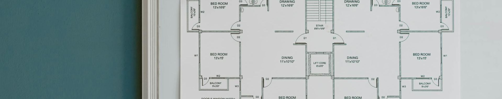

# CS 2510, Fall 2027, Topics
These are the topics we are going to cover in class each day. Links to [example student videos ](https://www.youtube.com/playlist?list=PLH9qo0GKu2iSlchbSeksN18S87gMIjHOg) 

# Day 13 - October 07 - Game Object Children and Mouse (🧑‍🏫Lecture 9)

## 🖼️Activity: Game are built using hierarchies
- Look for game object hierarchies in [Mario Kart 64](https://www.youtube.com/watch?v=w8K-heSWX8s)
- Look how game object hierarchies are used in [Echoes of Wisdom](https://youtu.be/01onjjAUnOQ?si=_08wHwSa2sMCxuGz&t=123)
- Look how game object hierarchies are used in [Zero Company](https://www.youtube.com/watch?v=rcxnRaZ6slU)
- Look how game object hierarchy are used in [Zelda Tears of the Kingdom](https://www.youtube.com/watch?v=m9_O94KqRAo)

## 💡New Idea: Game Object Can Have Child Game Objects
- This create powerful hierarchies
  - Allows for game objects to "hold" other game objects
  - Easy alignment of UI
  - Complex rotational movements

## 👩‍💻Code Together: Game Object Hierarchy
- Update Transform
  - setParent
  - getLocalMatrix
  - getGlobalMatrix
- Update GameObject draw
- Update Collisions
- Orbiting colliders

## 🖼️Activity: Look at an early game that used the mouse
- 1993's The Incredible Machine utilized the mouse to create a novel puzzle game
- [Gameplay from The Incredible Machine](https://www.youtube.com/watch?v=pTbSMKGQ_rU)

## 💡New Idea: Input This Frame
- We often need to know when a key or mouse button goes down or up, not just when it is held down
  - For example, when to fire a laser or when to "click" a button
- To do this, we need to track what input events happened each frame.
- We clear what happened each frame with an update function in Input

## 💡New Idea: Mouse Input
- The mouse buttons are labeled 0 (left), 1 (middle), and 2 (right)
- We can add mouse button events to our game engine

## 🖼️Activity: Look at an early game that used the mouse
- Deja Vu: A Nightmare Come True was an early escape room game
- [Gameplay from Deja Vu: A Nightmare Come True](https://www.youtube.com/watch?v=xwrqhsTFTVU)

## 🧭Ideas to explore on your own
- How can you convert your game to use hierarchies?
- Why do many games use a combination of inputs, e.g. mouse and keyboard instead of just keyboard or mouse?

  
---
---

# Day 12 - October 5  (👟Sprint 4)

## Topics covered briefly
- Line wrapping in TextLabels (do it yourself)
- Scene background bug
- JSDoc so VS Code is helpful
- Scale/rotate bug (make sure your code is updated)
- Review AI policy
- Compare code (e.g. githubcompare.com)
- Negative scales produce a flip
- Transparency in colors

# Day 11 - September 30 - Cameras and Layers (🧑‍🏫Lecture 8)

## Module: [`broadcastMessage`](./modules/broadcastMessage.md)

## Module: [Layers](./modules/Layers.md)

## Module: [Cameras](./modules/Cameras.md)

## 💡New Idea: Scenes can have background colors
- This allows you to really differentiate start and stop scenes from the main game scenes
- The Camera component of the main camera stores the background color

# Day 10 - September 28  (👟Sprint 3)

[No additional topics covered]

  
---
---

# Day 09 - September 23 - SceneManager & Globals (🧑‍🏫Lecture 7)

## Module: [`SceneManager`](./modules/SceneManager.md)

## Module: [`Globals`](./modules/Globals.md)

- Level Controllers

## 💡New Idea: Search game objects by attributes (tags)
- Unity doesn't allow you to search for multiple game objects by name
- Instead, we give game objects "tags", or a list of string attributes
- This allows us to look for all game objects that are tagged as enemies or UI
- The function we add is `GameObject.findGameObjectsWithTag`
  

  
---
---

# Day 08 - September 21  (👟Sprint 2)

## Module: [`getComponent`](./modules/GetComponent.md)

## Module: [`TextLabel`](./modules/TextLabel.md)

  
---
---

# Day 07 - September 16 - Communication Basics (🧑‍🏫Lecture 6)

Add scale and rotate to transforms. See the [Module on Transforms](./modules/Transform%20-%20Basics.md)

## Activity: Add an enemy ship to our game
- Our ship has the same shape as our player ship
  - We can save time by creating an asset and reusing it
  - We can save time by rotating the ship asset for the enemy ship

## Module: [Time.deltaTime](./modules/Time.deltaTime.md)

## Module: [GameObject.name](./modules/GameObject.name.md)

## Module: [Communication - GameObject.find](./modules/Communication%20-%20GameObject.find.md)

## Module: [Basic Collisions](./modules/Basic%20Collisions.md)

  
---
---

# Day 06 - September 14  (👟Sprint 1)

## Module: [Game Object Lifecycle - Destroy](./modules/Game%20Object%20Lifecycle%20-%20Destroy.md)

  
---
---

# Day 05 - September 9 - Engine-Level Components (🧑‍🏫Lecture 5)

## Module: [Transform - Basics](./modules/Transform%20-%20Basics.md)

## Module: [Instantiate](./modules/Instantiate.md)

## Module: [Polygon Component](./modules/Polygon%20Component.md)

## Module: [Customizable Components](./modules/Customizable%20Components.md)

## Activity: Look for Scenes, Game Objects, and Components
- Look at a video about a game and look for scenes, game objects, and components

  
---
---

# Day 04 - September 2 - Standard Architecture for Games (🧑‍🏫Lecture 4)

## 📢Announcements
- Upcoming sprint expectations
  - You can [study JS](https://javascript.info) as part of your sprint
  - You can plan the scenes, game objects, and components in your game. Just make sure you can show it to us during the sprint.
  - You can review/finish transcribing the engine. You can go through and add comments to help you understand the concepts.
  - Otherwise, work on your engine and game

## Module: [Standard Architecture for Games](./modules/Standard%20Architecture%20for%20Games.md)

  
---
---

# Day 03 - August 31 - Engines and Keyboard Input (🧑‍🏫Lecture 3)

## 🔙Review
- What is a game loop?
- What is a vector?

## Module: [Intro to Game Engines](./modules/Intro%20to%20Game%20Engines.md)

## Module: [Intro to Keyboard Input](./modules/Intro%20to%20Keyboard%20Input.md)

  
---
---

# Day 02 - August 26 - Game Loop (🧑‍🏫Lecture 2)

## 📺 Video Summary
- Many of the topics from this lecture can be found in [this video about game loops](https://www.youtube.com/watch?v=zIxjCk4BCHE)

## 🔙Review
- What is the difference between the Box Model, SVG, and Canvas?
- What is the difference between the JS keyword `let` and `const`?

## Syllabus Review

## 💡New Idea: What is a computer game? (Review from previous day)
- In this class, a game is an enjoyable, interactive, visual simulation.
- How are we going to learn game programming?
  - Learn the math
  - Learn the architecture
  - Practice

## Module: [Introduction to Game Loop](./modules/Intro%20to%20Game%20Loop.md)

## Module: [Introduction to Vectors](./modules/Introduction%20to%20Vectors.md)

## Module: [Classes in Javascript](./modules/Classes%20in%20Javascript.md)

## 👩‍💻Activity
- Create a simple moving game object simulation using the new Vector2 class. 

## 🤔To Think About
- Why is creative mode in Minecraft considered a game while a painting app is not?

## Ideas to explore on your own
- Can you make the code use arrays so that you don't need to manually call `lineTo` for each vertex?

  
---
---

# Day 01 - August 24 - Introduction (🧑‍🏫Lecture 1)

## 📺 Video Summary
- Many of the topics from this lecture can be found in [this video about game loops](https://www.youtube.com/watch?v=zIxjCk4BCHE)

## 📢Announcements
- Welcome to class
- Get a GitHub account

## Module: [Game Programming Courses](./modules/Game%20Programming%20Courses.md)

## 🎉Course Goals
- We are going to build a 2D game engine and game in [JavaScript](javascript.info)
- So we can focus on programming, not gathering assets, our games in this class will not include:
  - Images (Including emoji)
  - Sounds
- I will be using the [VS Code IDE](https://code.visualstudio.com/) in class, but you can use any IDE
- I will be using the [Live Server](https://marketplace.visualstudio.com/items?itemName=ritwickdey.LiveServer) in VS Code, but you don't have to.
- You can see some [examples of what previous students have done on YouTube](https://www.youtube.com/playlist?list=PLH9qo0GKu2iSlchbSeksN18S87gMIjHOg)
  
## Module: [Drawing in HTML](./modules/Drawing%20in%20HTML.md)

## Module: [Intro to JavaScript](./modules/Intro%20to%20Javascript.md)

## Module: [Drawing to a Canvas](./modules/Drawing%20on%20a%20Canvas.md)
  

