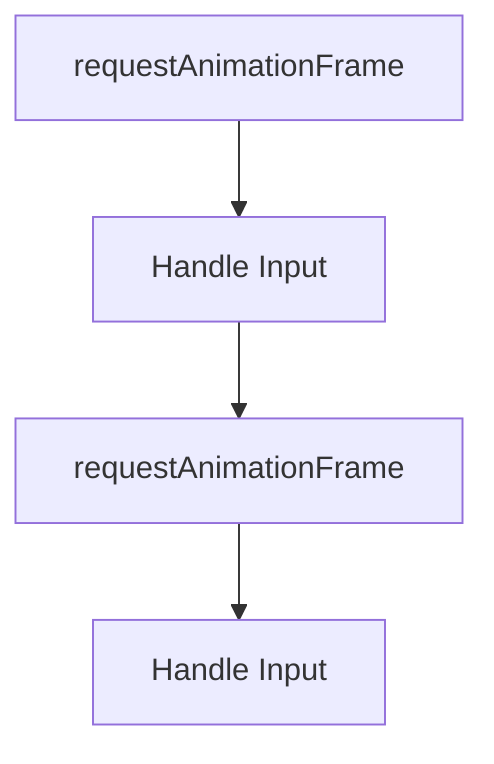

## 💡New Idea: Keyboard Input
- How is input handled by the computer?

- How can we capture keyboard changes?
- 🛝See slides on Input

## 👩‍💻Activity: Add Input Class to our Engine
```javascript
class Input{
  static keysDown = []

  static keyDown(event){
    Input.keysDown.push(event.code)

  }

  static keyUp(event){
    Input.keysDown = Input.keysDown.filter(k=>k!=event.code)
  }
}
```

## 👩‍💻Activity: Add Connect our Input Class to our Engine
Add the following to the `start()` function of `Engine.js`
```javascript
addEventListener("keydown", Input.keyDown)
addEventListener("keyup", Input.keyUp)
```


## 👩‍💻Activity: Keyboard Input
- Move a game object on the screen based on keyboard input
- We do this by listening for keyboard events in the `update()` function of a component
- Here is an example of what this might look like:
```javascript
 if(Input.keysDown.includes("ArrowRight"))
  this.transform.position.x += 1
    
if(Input.keysDown.includes("ArrowLeft"))
  this.transform.position.x -= 1
```


## 🤔To Think About
- Why do many games use a combination of inputs, e.g. mouse and keyboard instead of just keyboard or mouse?
