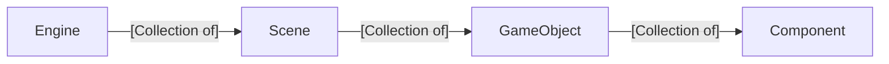

## 📺 Video Summary
- Many of the topics from this lecture can be found in [this video about architecture](https://www.youtube.com/watch?v=cbsK1Tvr4Vs)

## 💡New Idea: Main Game Architectural Hierarchy
- Engine
  - An engine is a collection of scenes. 
  - An engine tracks the current scene
- Scenes (also levels or stages)
  - A scene is a collection of game objects
- Game Objects (also actors or pawns or entities)
  - A game object is a collection of components
- Components (also scripts)
  - A component has the mutable data about a game object
  - A component has the start, update and draw functions for a game object

## 👩‍💻Activity
- Create the files for engine-specific classes
  - Engine
  - Scene
  - GameObject
  - Component
- Add the start, update, and draw functions to each engine-specific class

## 👩‍💻Activity
- Create the files for game-specific classes
  - MainScene
  - BatSymbolGameObject
  - BatSymbolController
- Add the constructor, start, update, and draw functions to each game-specific class
- Rewrite the code so that the html code uses these new classes (see Final code section below).

## 👩‍💻Activity
- Look at a modern game that isn't even 2D. Where do you see Scenes, GameObjects, and Components
  

## 🤔To Think About
- Can you add a second game object that has a random velocity and is colored red using this architecture?