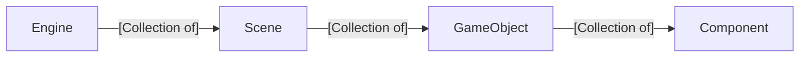

## 📺 Video Summary
- Many of the topics from this lecture can be found in [this video about architecture](https://www.youtube.com/watch?v=cbsK1Tvr4Vs)

## 💡New Idea: Main Game Architectural Hierarchy
- Engine
  - An engine is a collection of scenes. 
  - An engine tracks the current scene
- Scenes (also levels or stages)
  - A scene is a collection of game objects
- Game Objects (also actors or pawns or entities)
  - A game object is a collection of components
- Components (also scripts)
  - A component has the mutable data about a game object
  - A component has the start, update and draw functions for a game object


```mermaid
flowchart LR
  Engine --[Collection of]--> Scene
  Scene --[Collection of]--> GameObject
  GameObject--[Collection of]-->Component

```

## 👩‍💻Activity
- Create the files for engine-specific classes
  - Engine
  - Scene
  - GameObject
  - Component
- Add the start, update, and draw functions to each engine-specific class

## 👩‍💻Activity
- Create the files for game-specific classes
  - MainScene
  - BatSymbolGameObject
  - BatSymbolController
- Add the constructor, start, update, and draw functions to each game-specific class
- Rewrite the code so that the html code uses these new classes (see Final code section below).

## 👩‍💻Activity
- Look at a modern game that isn't even 2D. Where do you see Scenes, GameObjects, and Components
  

## 🤔To Think About
- Can you add a second game object that has a random velocity and is colored red using this architecture?

> [!Note] FAQ: How do I add a new scene to my game?
>
> In the `game` folder, create a new file that follows this pattern:
> ```javascript
> class NewScene extends Scene{
>   constructor(){
>     super()
>     this.instantiate(new /*reference to game object class you want to instantiate*/(), new Vector2(/*location of new game object*/)) 
>     /* Continue adding game objects as needed */
>   }
> }
> ```
> ! Don't forget to add a `<script src="[scene file name].js"></src>` to your `index.html` file


> [!Note] FAQ: How do I add a new game object to my game?
>
> In the `game` folder, create a new file that follows this pattern:
> ```javascript
> class NewGameObject extends GameObject{
>   constructor(){
>     super()
>     this.addComponent(new /*reference to component class you want to add*/()) 
>     /* Continue adding components as needed */
>   }
> }
> ```
> - Don't forget to add a `<script src="[game object file name].js"></src>` to your `index.html` file
> - In order for you to see your new game object, it needs a component that draws
> - You also need to add the game object to a scene before it will be in your game

> [!Note] FAQ: How do I add a new component  to my game?
>
> In the `game` folder, create a new file that follows this pattern:
> ```javascript
> class NewComponent extends Component{
>   start(){
>     /* Code for the component when it starts*/
>   }
>   update(){
>     /* Code for the component when it update*/
>   }
>   draw(ctx){
>     /* Code for the component when it updates*/
>   }
> }
> ```
> - Don't forget to add a `<script src="[component file name].js"></src>` to your `index.html` file
> - In order for your component to be in your game, it needs to be attached to a game object that is in a scene
